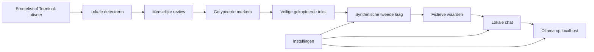
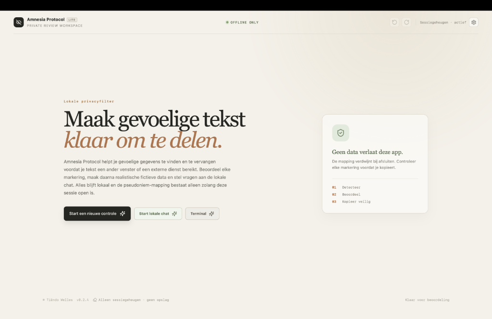
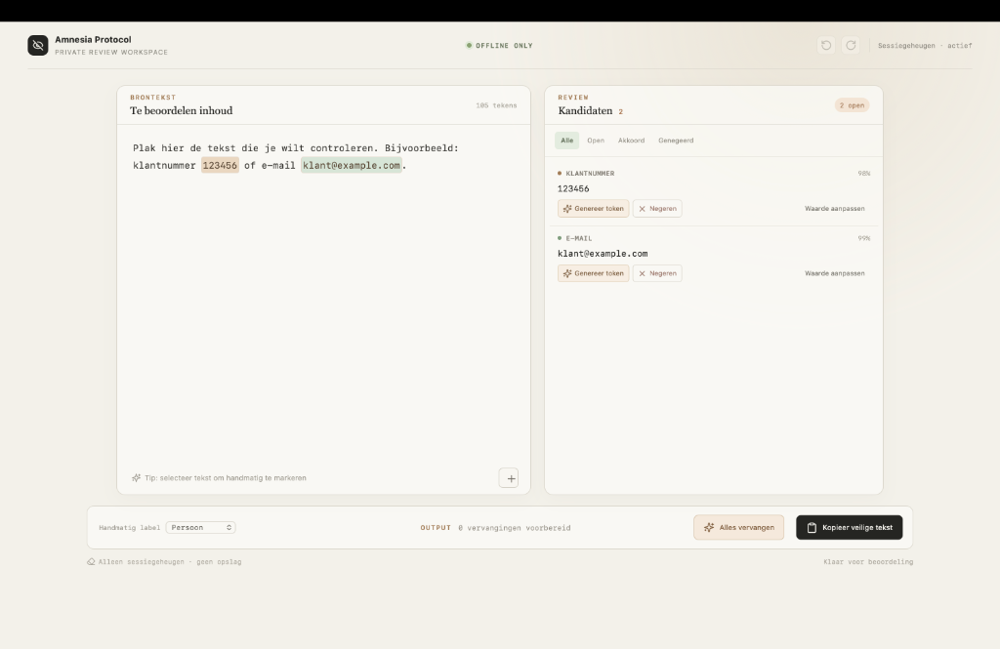
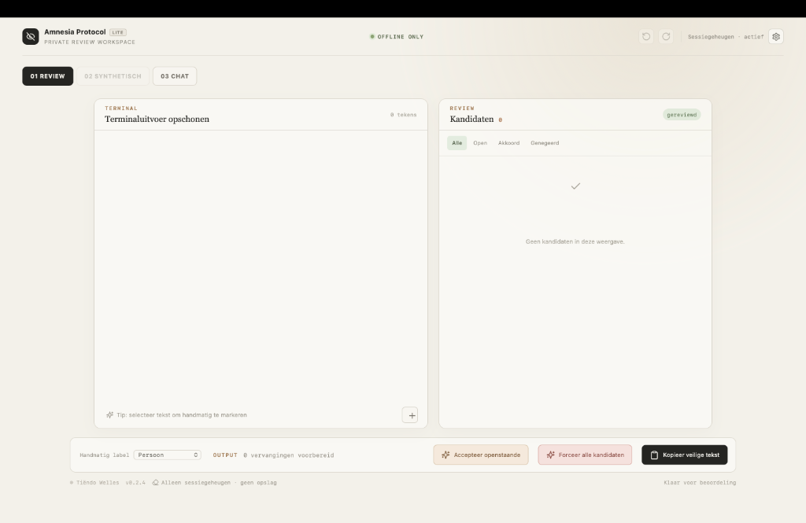
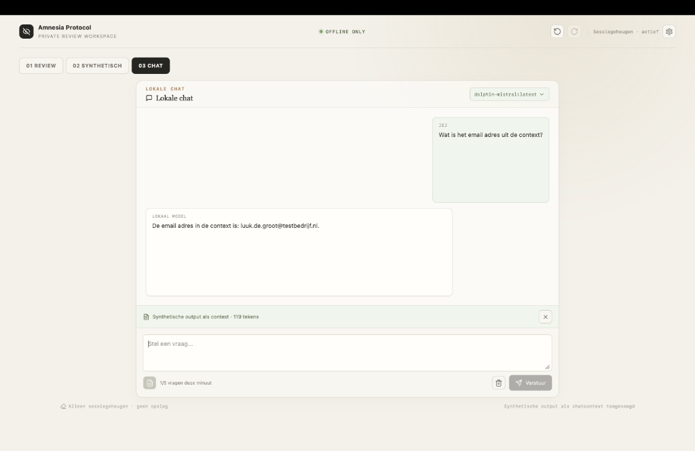

# Amnesia Protocol Lite

[](#status)
[](#privacy-en-beveiliging)
[](#privacy-en-beveiliging)
[](#synthetische-tweede-laag)
[](#installeren)

[](https://react.dev/)
[](https://www.typescriptlang.org/)
[](https://vite.dev/)
[](https://tauri.app/)
[](https://www.rust-lang.org/)
[](https://tailwindcss.com/)
[](#testen-en-bouwen)
[](#testen-en-bouwen)

Amnesia Protocol Lite is een lokale desktopwerkplek voor het gecontroleerd opschonen en synthetiseren van gevoelige tekst. De app combineert menselijke review, getypeerde pseudonimisering en een expliciete tweede laag voor realistische fictieve data. Zo kan tekst veilig worden voorbereid voordat die een ander venster of een cloud-LLM bereikt.

De app is ontworpen voor persoonlijk gebruik op één Mac. Het doel is gecontroleerde pseudonimisering en synthetische vervanging, niet anonimiteit of een garantie dat alle indirecte identificerende informatie verdwijnt.

## Architectuur



De app heeft geen serverlaag. De standaardflow blijft binnen de desktopapp; alleen de optionele lokale AI-functies praten met Ollama op dezelfde Mac.

## Screenshots

### Welkomstscherm



### 01 Review Workspace



### Terminaluitvoer Opschonen



### 03 Lokale Chat



## Kernprincipes

- **Lokaal als standaard:** detectie, review en standaardgeneratie draaien op de Mac zonder account, cloudservice of telemetrie.
- **Twee expliciete lagen:** eerst wordt gevoelige tekst omgezet naar markers; daarna plakt de gebruiker die veilige tekst bewust in de synthetische laag.
- **Menselijke controle:** kandidaten, markers en gegenereerde waarden blijven zichtbaar en aanpasbaar.
- **Privacy door ontkoppeling:** laag 2 ontvangt alleen markers zoals `EMAIL_1` en nooit de oorspronkelijke bronwaarde.
- **Eerlijke grenzen:** geen enkele detector of pseudoniem maakt tekst automatisch volledig anoniem.

## Workflow

### Laag 1: Review en pseudonimisering

1. Start een nieuwe controle.
2. Plak tekst in het bronvenster.
3. Bekijk de automatisch gevonden kandidaten.
4. Kies per kandidaat `Genereer token`, `Negeren` of `Waarde aanpassen`.
5. Voeg gemiste passages handmatig toe met de `+`-knop.
6. Gebruik eventueel `Accepteer openstaande`; eerdere genegeerde of aangepaste kandidaten blijven ongemoeid.
7. Controleer de vervangingen en klik op `Kopieer veilige tekst`.

### Laag 2: Synthetische vervanging

1. Open tabblad `02 Synthetisch`.
2. Plak daar zelf de gekopieerde tekst uit laag 1.
3. Controleer de gevonden markers.
4. Klik expliciet op `Genereer standaardvervangers`.
5. Gebruik voor `OTHER` optioneel een lokaal Ollama-model.
6. Controleer en corrigeer de fictieve waarden.
7. Klik op `Kopieer synthetische tekst`.

### Terminal: Uitvoer opschonen

1. Klik op `Terminal` vanaf het welkomstscherm.
2. Plak terminaluitvoer in de editor.
3. Laat mogelijke API keys, tokens, private keys, credential-URL's, accountpaden en Git-remotes markeren.
4. Beoordeel iedere kandidaat zoals in de normale reviewflow.
5. Kopieer de opgeschoonde terminaltekst en gebruik optioneel de synthetische laag.

### Laag 3: Lokale chat

1. Open tabblad `03 Chat`.
2. Stel vragen aan het geselecteerde lokale Ollama-model.
3. Voeg alleen via de icon-only contextknop de synthetische output toe.
4. Wis het gesprek wanneer je de sessiecontext wilt verwijderen.

De veilige bulkactie accepteert alleen openstaande kandidaten. `Forceer alle kandidaten` is een aparte, expliciet bevestigde actie die ook eerder genegeerde kandidaten accepteert. Geen van beide acties kopieert automatisch; controleer de tekst altijd voordat je op `Kopieer veilige tekst` klikt.

## Detectie

De detectoren werken volledig lokaal met regexen, contextregels en checksums waar mogelijk. De huidige typen zijn:

- E-mailadressen
- Nederlandse mobiele, vaste en zakelijke telefoonnummers
- IBAN met mod-97-validatie
- BSN met elfproef-validatie
- IPv4-adressen
- Nederlandse postcodes, inclusief plaatscontext
- Straatadressen met huisnummer als `address`
- Numerieke en geschreven datums, inclusief korte jaaraanduidingen
- Internetdomeinen en websites
- Persoonsnamen met initialen en contextlabels zoals `naam:` of `contactpersoon:`
- Klant-, lid-, relatie-, account-, polis- en personeelsnummers
- Transactie-, order-, bestel-, factuur-, ticket- en betalingsnummers
- Serienummers, apparaat-ID's, contract- en chassisnummers
- Dossier-, zaak-, referentie-, KvK- en BTW/VAT-nummers

Context is belangrijk. Een los nummer kan niet betrouwbaar worden onderscheiden als bijvoorbeeld BSN, klantnummer of transactienummer. Een nummer na `klantnummer:` krijgt daarom een andere classificatie dan dezelfde waarde zonder context.

## Pseudonimiseren

Goedgekeurde waarden krijgen een typegebonden token:

```text
klant@example.com       -> EMAIL_1
klantnummer 123456      -> CUSTOMER_1
transactie TX-2025-04   -> TRANSACTION_1
serienummer SN8844      -> SERIAL_1
```

Dezelfde waarde krijgt binnen één actieve sessie hetzelfde token. Bij het sluiten van de app verdwijnt de mapping. Er is bewust nog geen vault, wachtwoordscherm, projectbestand of persistente opslag.

## Synthetische tweede laag

In tabblad `02 Synthetisch` plakt de gebruiker eerst zelf de veilige tekst uit laag 1. Alleen ondersteunde markers zoals `EMAIL_1`, `CUSTOMER_1` en `LINK_1` worden herkend; de tweede laag ontvangt geen bronwaarden uit de eerste laag. Na een expliciete klik worden de markers opnieuw opgebouwd als realistische, volledig fictieve waarden. Kies in de synthetische laag Nederlands of English. E-mailadressen, personen, telefoonnummers, IBAN's, BSN's, postcodes, datums, identifiers en links worden lokaal en deterministisch gegenereerd. De tekst wordt pas gekopieerd nadat alle vervangers zijn ingevuld.

`OTHER` wordt niet willekeurig ingevuld. Hiervoor kan optioneel een lokaal Ollama-model worden gebruikt. De app communiceert hiervoor uitsluitend met `http://localhost:11434`; er worden geen cloudmodellen of externe endpoints ondersteund. De gekozen taal wordt ook aan de lokale prompt meegegeven. In de tweede laag kan de gebruiker het model en een gewenste formaatbeschrijving opgeven, bijvoorbeeld `intern projectnummer met prefix PROJ-`.

## Lokale chat

Tabblad `03 Chat` biedt een eenvoudige chat met het geselecteerde lokale Ollama-model. De oorspronkelijke bronlaag wordt nooit automatisch als context meegestuurd. Met de icon-only contextknop kan de gebruiker expliciet de synthetische output uit laag 2 toevoegen. De chat gebruikt maximaal 4.000 contexttokens, maximaal 512 outputtokens, maximaal 5 vragen per minuut en minimaal 3 seconden tussen vragen. Chatgeschiedenis bestaat alleen in het sessiegeheugen.

De modelcatalogus kan optioneel modellen via Ollama downloaden. Voor elke download toont de app de geschatte omvang en aanbevolen RAM en vraagt hij expliciet om bevestiging. Zonder Ollama blijven review, pseudonimisering en standaard synthetische vervanging beschikbaar.

## Instellingen

Open het tandwiel in de topbar om voorkeuren te beheren. De voorkeuren worden tussen appstarts lokaal bewaard:

- automatisch Mistral met Gemma 3 1B als lichte fallback;
- taal voor synthetische waarden en lokale prompts;
- automatische clipboard-cleartimer;
- lokale modellen verversen en nieuwe modellen downloaden.

In de chat toont de modelbadge welk lokaal model actief is. Mistral en compatibele Mistral-varianten zoals `dolphin-mistral:latest` krijgen voorrang; Gemma 3 1B wordt automatisch gebruikt als fallback. Alleen voorkeuren worden persistent opgeslagen. Brondata, mappings en chatgeschiedenis blijven sessiegebonden.

## Technologie

- React 19 en TypeScript
- Vite
- Tauri 2
- Rust als minimale desktoplaag
- Tailwind CSS en lokale styles
- Vitest voor unit-tests
- Playwright voor end-to-end-tests
- Tauri clipboard-plugin voor lokaal klembordgebruik
- Ollama als optionele lokale AI-runtime voor `OTHER`

## Installeren

Vereisten:

- macOS op Apple Silicon voor de huidige `.app`-build
- Node.js 22 of nieuwer
- Rust en Cargo
- Ollama is alleen nodig voor AI-vervanging van `OTHER`

## Ollama installeren

Ollama wordt niet meegeleverd met de macOS-app. Zonder Ollama blijven Review, Terminal en standaard synthetische vervanging gewoon werken. Alleen lokale chat en AI-vervanging van `OTHER` hebben Ollama nodig.

1. Installeer Ollama voor macOS via [ollama.com/download/mac](https://ollama.com/download/mac).
2. Open Ollama één keer zodat de lokale server draait.
3. Open in Amnesia Protocol `Instellingen` en klik op `Ververs lokale modellen`.
4. Installeer eventueel Mistral of de lichte Gemma 3 1B-fallback vanuit hetzelfde instellingenpaneel.

De app communiceert alleen met Ollama op `http://localhost:11434`. Modeldownloads zijn de enige optionele actie die een internetverbinding gebruikt. Als Ollama niet aanwezig is, toont Instellingen een korte onboarding met deze stappen.

Installeer dependencies:

```bash
npm install
```

Optionele lokale AI instellen:

```bash
ollama serve
ollama pull mistral
ollama pull gemma3:1b
```

De tweede laag gebruikt automatisch een lokaal Mistral-model, inclusief compatibele varianten zoals `dolphin-mistral:latest`. Als geen Mistral-variant beschikbaar is, valt de app terug op het lichte `gemma3:1b`-model. Via `Ververs lokale Ollama-modellen` worden alleen lokaal geïnstalleerde modellen gecontroleerd. Vanuit Instellingen kunnen Mistral of de fallback expliciet worden gedownload, met een waarschuwing voor downloadgrootte en aanbevolen RAM. De app gebruikt uitsluitend Ollama op `http://localhost:11434`; zonder Ollama blijven alle standaardvervangers volledig offline beschikbaar.

Start de webontwikkelserver:

```bash
npm run dev
```

Start de desktopapp in development mode:

```bash
npm run tauri dev
```

## Testen en bouwen

Unit-tests:

```bash
npm run test
```

End-to-end-tests:

```bash
npm run test:e2e
```

Codekwaliteit:

```bash
npm run lint
npm run format
```

Productiebuild:

```bash
npm run tauri build
```

De standaard Tauri-build maakt de macOS-app zonder Finder-automatisering:

```text
src-tauri/target/release/bundle/macos/Amnesia Protocol.app
```

Een DMG kan lokaal zonder AppleScript worden gemaakt met:

```bash
hdiutil create \
  -volname "Amnesia Protocol" \
  -srcfolder "src-tauri/target/release/bundle/macos/Amnesia Protocol.app" \
  -ov \
  -format UDZO \
  "src-tauri/target/release/bundle/dmg/Amnesia Protocol_0.2.5_aarch64.dmg"
```

## Klembordcontrole

Beide kopieeracties gebruiken dezelfde lokale clipboardadapter. Na het schrijven leest Amnesia Protocol het klembord direct terug en vergelijkt het resultaat met de verwachte tekst. Alleen bij een overeenkomende readback wordt succes gemeld. De UI toont tijdens het kopiëren `Kopiëren...` en daarna een blijvende succes- of foutstatus naast de knoppen.

Het klembord wordt standaard na 60 seconden automatisch geleegd. In de reviewbalk kan dit worden aangepast naar 30 seconden, 60 seconden, 5 minuten of `Nooit`. De app wist alleen wanneer de clipboardinhoud nog exact overeenkomt met de laatst door Amnesia Protocol gekopieerde tekst; inhoud die intussen door een andere app is geplaatst blijft ongemoeid.

De browser-e2e-tests geven Playwright expliciete klembordrechten en controleren de gekopieerde inhoud. Dit valideert de browserfallback. Controleer voor een native macOS-release ook handmatig de gebouwde `.app`: kopieer een tekst met een token, plak die in een lokale teksteditor en controleer dat bijvoorbeeld `EMAIL_1` aanwezig is. De native Tauri-permissies staan in `src-tauri/capabilities/default.json`.

## Privacy en beveiliging

Zolang je de app lokaal gebruikt, blijft de normale verwerking op je Mac. De detectoren werken lokaal, de review gebeurt lokaal en de mapping leeft alleen in het geheugen van deze sessie. De tweede laag ontvangt alleen de tekst die je zelf kopieert en plakt; de oorspronkelijke bronmapping wordt niet automatisch doorgegeven. De optionele AI-functies praten uitsluitend met Ollama op `localhost`.

Er is geen account, backend, analytics of telemetrie. De app voert geen Terminal-commando's uit en leest geen Terminalvensters automatisch; Terminaldata wordt alleen verwerkt nadat je die zelf plakt. Alleen niet-gevoelige voorkeuren zoals taal, modelbeleid en clipboardtimer worden lokaal tussen appstarts bewaard.

FileVault beschermt de Mac op schijfniveau. De app gebruikt in deze versie geen extra encryptielaag omdat de mapping niet persistent wordt opgeslagen. De brondata en mapping leven tijdens gebruik wel tijdelijk in het geheugen van de applicatie.

Let op:

- Clipboardinhoud kan door andere lokale apps worden gelezen.
- Een gepseudonimiseerde tekst kan nog indirect identificerende informatie bevatten.
- Automatische detectie is geen garantie dat alle gevoelige informatie is gevonden.
- Vertrouw niet uitsluitend op de bulkactie voor gegevens met hoge impact; beoordeel bij voorkeur de kandidaten handmatig.

## Bekende beperkingen

- Namen zonder duidelijke context worden niet algemeen via NER gedetecteerd. Handmatig markeren blijft nodig voor veel namen.
- Overlapresolutie is bewust eenvoudig en gericht op korte geplakte teksten. Bij complexe meervoudige overlaps kan menselijke controle nodig zijn.
- PDF, DOCX, OCR, CSV-structuurbehoud en bestandsimport/export zijn nog geen onderdeel van deze MVP.
- Persistente mapping tussen sessies is uitgesteld tot daar een concreet gebruiksmoment voor bestaat.

## Projectstructuur

```text
src/
  App.tsx             App-shell en laagselectie
  HomeScreen.tsx      Welkomstscherm
  ReviewWorkspace.tsx Revieweditor en kandidaatlijst
  ReviewBottomBar.tsx Reviewacties en clipboardknoppen
  AppDialog.tsx       Modalweergave en focusbeheer
  ChatPanel.tsx       Lokale chat met optionele synthetische context
  chat.ts             Chatlimieten en contextbeheer
  SettingsPanel.tsx   Persistente voorkeuren en Ollama-modelbeheer
  settings.ts         Lokale voorkeuren tussen appstarts
  useDialog.ts        Confirm- en promptlogica
  useReviewState.ts   Debounced detectie, history en reviewacties
  useClipboard.ts     Clipboardstatus en readback-verificatie
  SyntheticPanel.tsx  Tweede laag voor geplakte markers
  detectors.ts        Review- en Terminal-detectoren, contextregels en checksums
  synthetic.ts        Markerparser en fictieve datageneratoren
  ollama.ts           Lokale Ollama-integratie voor OTHER
  review.ts           Reviewacties, merge-logica en vervanging
  types.ts            Domeintypen en labels
  *.test.ts           Unit-tests
e2e/
  review.spec.ts      Playwright-workflowtests
src-tauri/
  src/                Minimale Tauri/Rust-entrypoint
  capabilities/       Beperkte desktoppermissies
```

## Status

De huidige implementatie bevat de Fase 1/2-MVP plus Terminal-opschoning en een lokale chatlaag: lokale review, detectie van Terminal-secrets en accountpaden, uitgebreide Nederlandse detectieregels, sessiegebonden pseudonimisering, een onafhankelijk geplakte synthetische tweede laag, Engelse synthetische waarden, optionele lokale Ollama-AI, lokale modeldownloads met hardwarewaarschuwing, clipboardcontrole, snapshot-history, gescheiden veilige en geforceerde bulkacties, debounce voor langere teksten en een begrensde lokale chat. De tests en productiebuild moeten groen zijn voordat wijzigingen als afgerond worden beschouwd.
